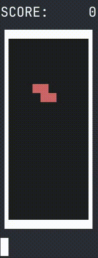

# Tetris
This is an implementation of Tetris written in SED. The entire game logic and rendering runs in sed by manipulating a buffer that represent the state of the game.
Since SED has no way to handle time or read input character by character, the driver script breaks the input in different lines and send the ticks to the game.

I use Shell as a "macro" language for the repetitive parts of the program, the file compile.sh read the spec file and outputs the SED script (which is also on this repo so you can see it).

For the PRNG I wrote an implementation of XORShift+ in SED, I chose this algorithm because it only involves shifts, XORs, and additions which are simpler to implement in SED than multiplications or divisions.

Everything should be POSIX, I made a POSIX and a non-POSIX version of the driver because the POSIX version involves messing with termios while the Bash version only uses read.

## How to play

```sh
git clone https://github.com/joachimgiron/portable-tetris.git tetris
cd tetris
./driver.sh
```


